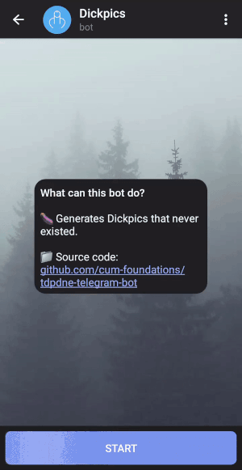

# TDPDNE.Telegram.Bot
  

This is a simple bot for generating dickpics.

❕ *Currently, the bot uses polling to receive updates from Telegram.
Also, due to the inability to have good hardware and as a result of generating new dickpics, [this](https://api.thisdickpicdoesnotexist.com) API is temporarily used to get them.*

 🎞️ Presentation

 

 ▶️ How to use

 

To launch the bot, you need to:

1. Download the latest release

2. Update *appsettings.json*:  
    * `"BotToken": "{BOT_TOKEN}"`  
    Replace `{BOT_TOKEN}` with your personal one received from [BotFather](https://t.me/BotFather)  

    * `"SupportContact": "{SUPPORT_CONTACT}"`  
    Replace `{SUPPORT_CONTACT}` with your contact information

    * `"Donations": "{DONATIONS}"`  
    Replace `{DONATIONS}` with your donations details  

     

    

    
 🔧(Not necessarily) Update WrapperConfiguration

     

    * `TDPDNEApiUrl`  
    The URL of the API for getting dickpics ids.  
    * `TDPDNEImageStorageUrl`  
    The URL of the API for getting dickpics images.  
    * `MagickFuzzPercentage`  
    Magick.NET configuration. Adjust the fuzz value as appropriate. But if you make it too large, your image will be trimmed too much.  
    * `AttemptsMaxCount`  
    The number of attempts to get the correct id for a dickpic. After the failure, the message *"Service is temporarily unavailable"* will be displayed.  
    * `MinId`  
    Minimum limit for obtaining a valid id.  
    * `MaxId`  
    Maximum limit for obtaining a valid id.  

    

3. Launch TDPDNE.Telegram.Bot.exe *(or publish a new file to run on your OS if it's not Windows x64 and then run it)*

4. Tell your friends that you love dicks

5. Enjoy! ✨

